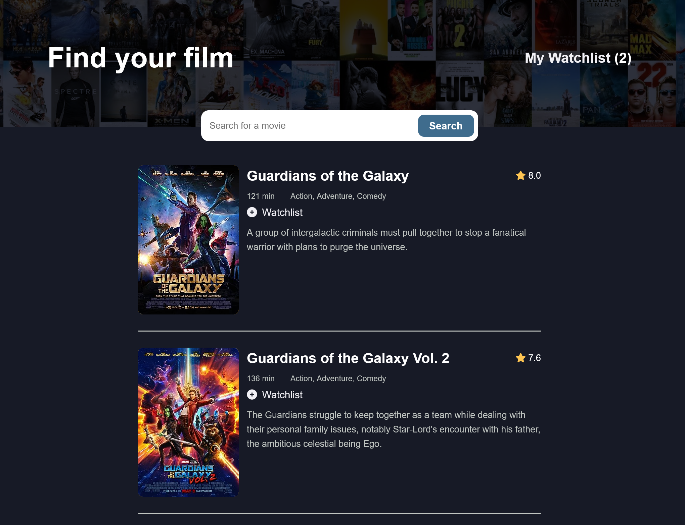

# Movie Watchlist Creator - Scrimba FEWD Project

This is a solution to the Movie Watchlist Creator solo project, as part of the Scrimba Frontend Developer Career Path, featuring the use of the [Open Movie Database API](https://www.omdbapi.com/). My solution incorporates the use of mobile-first design methodology, local storage, async/await, and other modern JavaScript methods. 

## Table of contents

- [Overview](#overview)
  - [Project requirements](#project-requirements)
  - [Screenshot](#screenshot)
  - [Links](#links)
- [My process](#my-process)
  - [Built with](#built-with)
  - [What I learned](#what-i-learned)
  - [Useful resources](#useful-resources)
- [Author](#author)

## Overview

### Project requirements 

- Develop a two page website: index.html and watchlist.html
- Design site according to supplied figma design comp
- index.html: search page, calls to OMDB API with the term searched, displaying 10 results
- Each result should be displayed on page's results section
- Each result should feature a button to save film to watchlist
- watchlist.html loads and displays the watchlist, saved using local storage
- Each result displayed should feature a button to remove film from watchlist page and local storage

### Additional enhancements

- Film result images link to the film's external IMDB page
- Search result items already saved to watchlist are identified
- Number of watchlist items saved displayed on home page
- Additional design customizations and enhancements

### Screenshot




### Links

- [Scrimba Scrim]()
- [Live Site]()

## My process

### Built with 

- Mobile-first methodology
- Semantic HTML5 markup
- Flexbox
- CSS Grid
- JavaScript, including async/await

### What I learned

Nested loops have been something I've often tried to avoid. However, this particular implementation seemed like the most straightforward approach for the function I'm using to check if a search result item is already saved to the local storage watchlist.

```js
function checkForSavedFilms() {
  const watchlist = getWatchlistFromStorage();

  const savedTagHtml = `
    <p class="saved-film">
      <i class="fa-solid fa-circle-check"></i> Film Saved
    </p>`
  // loop over searchResults to match films saved in watchlist
  for (let film of searchResults) {
    for (let savedFilm of watchlist) { // loop over watchlist for each film
      if (film.imdbID === savedFilm.imdbID) { // compare imdbID
        document.querySelector(`[data-btn-container="${savedFilm.imdbID}"]`).innerHTML = savedTagHtml;
      }
    }
  }
}
```

## Author

- Website - [Matt Pahuta](https://www.mattpahuta.com)
- Twitter - [@mattpahuta](https://www.twitter.com/MattPahuta)
